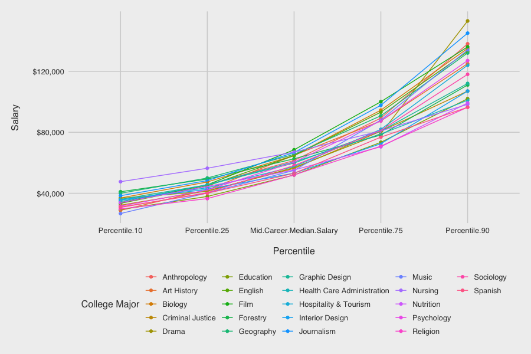
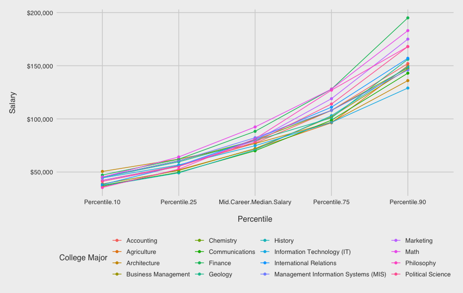
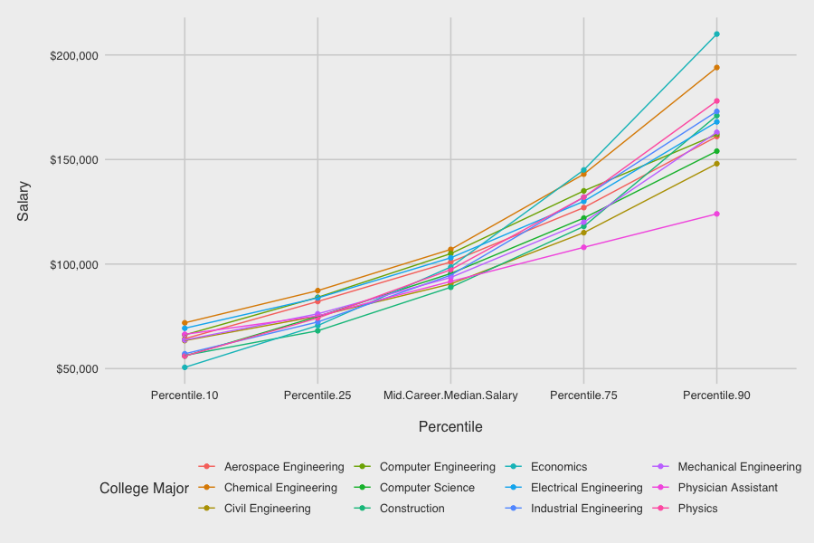

# Introduction

The following analysis explores the salary potential of college majors with a k-means cluster analysis. Choosing a college major is a complex decision evaluating personal interest, difficulty, and career prospects. Your first paycheck right out of college might say a lot about your salary potential by mid-career. If you're wondering whether that Philosophy major will really help you pay the bills? Or you're set with an Engineering degree? Whether you're in school or navigating the postgrad world, let's explore the short and long term financial implications of this *major* decision.

In this project, the dataset used is data collected from an year-long survey of 1.2 million people with only a bachelor's degree by PayScale Inc., made available at the following link:

http://online.wsj.com/public/resources/documents/info-Degrees_that_Pay_you_Back-sort.html?mod=article_inline

, by the Wall Street Journal for their article [__Ivy League's Big Edge: Starting Pay__](https://www.wsj.com/articles/SB121746658635199271). After doing some data clean up, we'll compare the recommendations from three different methods for determining the optimal number of clusters viz, the *Elbow method*, the *Silhouette method*, and the *Gap Statistics method*, apply a *k-means clustering* analysis, and visualize the results.

# Data Wrangling

## Getting Data

We begin the analysis by getting the data, in this case, *scrape* the data from The Wall Street Journal article at the aforementioned link.

We can scrape the *Salary Increase By Major* data from the web page using this code:

```{r clear, message=FALSE, include=FALSE}
#return memory to operating system
gc(full = TRUE)
```

```{r getting data, message=FALSE, warning=FALSE}
# Note: this process could take a couple of seconds

if(!require(rvest)) install.packages("rvest", repos = "http://cran.us.r-project.org")

# scrape dataset from the wall street journal article
url <- paste("http://online.wsj.com/public/resources/documents/",
       "info-Degrees_that_Pay_you_Back", "-sort.html?mod=article_inline")
h <- read_html(url)
nodes <- h %>% html_nodes('table')

# locate table of interest from nodes "xml_nodeset"
tab <- nodes[[7]]
raw_data <- html_table(tab)

rm(h, nodes, tab, url)
```

The scraped data is not in tidy format, we can confirm this by inspecting the first few rows of *raw_data* object:

```{r head raw_data, message=FALSE, warning=FALSE}
head(raw_data, 3)
```

and the *summary*:

```{r summary raw_data, message=FALSE, warning=FALSE}
summary(raw_data)
```


## Cleaning Data

Notice the column names of *raw_data* object are "X1" through "X8" which are not very informative. Also, after viewing first few rows of *raw_data* object, we notice the first row contains the column names for the table. 

We can transform the data to fix the issues discussed above using this simple code:

```{r transform data, message=FALSE, warning=FALSE}
if(!require(dplyr)) install.packages("dplyr", repos = "http://cran.us.r-project.org")

# transform the data
colnames(raw_data) <- c("College.Major", "Starting.Median.Salary",
                        
"Mid.Career.Median.Salary", "Career.Percent.Growth", "Percentile.10",
"Percentile.25", "Percentile.75", "Percentile.90")
raw_data <- raw_data[-1,]
rownames(raw_data) <- 1:nrow(raw_data)
```

We also need to fix the our salary data as it is in currency format, which R considers a string. Let's strip those special characters using the *gsub* function and convert all of our columns except *College.Major* column to numeric.

While we're at it, we can also convert the *Career.Percent.Growth* column to a decimal value.

```{r clean data, message=FALSE, warning=FALSE}
# strip '$' sign and convert Career.Percent.Growth to decimal value
degrees <- raw_data %>% mutate_at(vars(Starting.Median.Salary: Percentile.90), 
                                  function(x) as.numeric(gsub('[\\$,]',"",x))) %>%
                        mutate(Career.Percent.Growth = Career.Percent.Growth / 100)
```


# Salary Increase By Major Data

The *raw_data* object containing salary data scraped from the WSJ article, initially had 51 rows but wasn't necessarily clean. After some data wrangling the clean data frame *degrees* had 50 observations (for 50 majors).

Let's inspect the first few rows of *degrees* data frame and some *summary* statistics:

```{r head degrees, message=FALSE, warning=FALSE}
degrees %>% as_tibble()
```

```{r summary degrees, message=FALSE, warning=FALSE}
summary(degrees)
```


# Data Analysis

## Optimal number of clusters

Now that we have a more manageable dataset, let's begin our clustering analysis by determining how many clusters we should be modeling. The best number of clusters for an unlabeled dataset is not always a clear-cut answer, but fortunately there are several techniques to help us optimize. We'll work with three different methods to compare recommendations:

* Elbow Method
* Silhouette Method
* Gap Statistic Method

To begin, let's prepare by loading the following packages:

```{r packages, message=FALSE, warning=FALSE}
# Note: this process could take a couple of minutes

url <- "http://cran.us.r-project.org"
if(!require(tidyverse)) install.packages("tidyverse", repos = url)
if(!require(cluster)) install.packages("cluster", repos = url)
if(!require(factoextra)) install.packages("factoextra", repos = url)
if(!require(ggthemes)) install.packages("ggthemes", repos = url)
```


### 1. The elbow method

First up will be the __Elbow Method__. This method plots the percent variance against the number of clusters. The "elbow" bend of the curve indicates the optimal point at which adding more clusters will no longer explain a significant amount of the variance. To begin, let's select and scale the following features to base our clusters on: *Starting.Median.Salary*, *Mid.Career.Median.Salary*, *Percentile.10*, and *Percentile.90.* Then we'll use the fancy *fviz_nbclust* function from the *factoextra* library to determine and visualize the optimal number of clusters.

```{r elbow_method, message=FALSE, warning=FALSE, fig.width = 6, fig.align = "center"}
# select and scale the relevant features and store as k_means_data
k_means_data <- degrees %>%
                select(Starting.Median.Salary, Mid.Career.Median.Salary, 
                       Percentile.10, Percentile.90) %>% scale()

# run the fviz_nbclust function with selected data and method "wss"
elbow_method <- fviz_nbclust(k_means_data, FUNcluster = kmeans, method = "wss")
elbow_method + theme_fivethirtyeight() + theme(axis.title = element_text()) + 
               xlab('\nNumber of clusters k') + 
               ylab('Total Within Sum of Square\n')
```


### 2. The silhouette method

*fviz_nbclust* function was pretty nifty. Instead of needing to "manually" apply the elbow method by running multiple k_means models and plotting the calculated total within cluster sum of squares for each potential value of k, *fviz_nbclust* handled all of this for us behind the scenes. The *fviz_nbclust* can be used for the __Silhouette Method__ as well.

The Silhouette Method will evaluate the quality of clusters by how well each point fits within a cluster, maximizing average "silhouette" width.

```{r silhouette_method, message=FALSE, warning=FALSE, fig.width = 6, fig.align = "center"}
# run the fviz_nbclust function with the method "silhouette" 
silhouette_method <- fviz_nbclust(k_means_data, FUNcluster = kmeans, method = "silhouette")
silhouette_method + theme_fivethirtyeight() + 
                    theme(axis.title = element_text()) + 
                    xlab('\nNumber of clusters k') + 
                    ylab('Average silhouette width\n')
```


### 3. The gap statistic method

It seems that the two methods so far disagree on the optimal number of clusters. Let's pull out the tie breaker.

For our final method, let's see what the __Gap Statistic Method__ has to say about this. The Gap Statistic Method will compare the total variation within clusters for different values of k to the null hypothesis, maximizing the "gap." The "null hypothesis" refers to a uniformly distributed simulated reference dataset with no observable clusters, generated by aligning with the principle components of our original dataset. In other words, how much more variance is explained by k clusters in our dataset than in a fake dataset where all majors have equal salary potential?

We have the *clusGap* function to calculate this behind the scenes and the *fviz_gap_stat* function to visualize the results.

```{r gap_stat_method, message=FALSE, warning=FALSE, fig.width = 6, fig.align = "center"}
# use the clusGap function to apply the Gap Statistic Method
gap_stat <- clusGap(k_means_data, FUN = kmeans, nstart = 25, K.max = 10, B = 50)

# use the fviz_gap_stat function to vizualize the results
gap_stat_method <- fviz_gap_stat(gap_stat)
gap_stat_method + theme_fivethirtyeight() + 
                  theme(axis.title = element_text()) + 
                  xlab('\nNumber of clusters k') + 
                  ylab('Gap Statistic (k)\n')
```


## K-means algorithm

Looks like the Gap Statistic Method agreed with the Elbow Method! According to majority rule, let's use 3 for our optimal number of clusters. With this information, we can now run our k-means algorithm on the selected data. We will then add the resulting cluster information to label our original dataframe.

```{r k_means, message=FALSE, warning=FALSE}
# set a random seed
suppressWarnings(set.seed(111, sample.kind = 'Rounding'))

# set k equal to the optimal number of clusters
num_clusters <- 3

# run the k-means algorithm 
k_means <- kmeans(k_means_data, centers = num_clusters, iter.max = 15, nstart = 25)

# label the clusters of degrees
degrees_labeled <- degrees %>%
                   mutate(clusters = k_means$cluster)
```


## Visualizing the clusters

Now for the pretty part: visualizing our results. First let's take a look at how each cluster compares in Starting vs. Mid Career Median Salaries. What do the clusters say about the relationship between Starting and Mid Career salaries?

```{r career_growth, message=FALSE, warning=FALSE, fig.height = 6}
# graph the clusters by Starting and Mid Career Median Salaries
career_growth <- ggplot(degrees_labeled, aes(x = Starting.Median.Salary, 
  y = Mid.Career.Median.Salary, color=factor(clusters))) + 
  geom_point(alpha = 4/5, size = 7) +
  scale_x_continuous(labels = scales::dollar) +
  scale_y_continuous(labels = scales::dollar) + 
  scale_color_manual(name = "Clusters", values = c("#EC2C73", "#29AEC7", "#FFDD30"))

career_growth + theme_fivethirtyeight() + 
                theme(axis.title = element_text()) + 
                xlab('\nStarting Median Salary') + 
                ylab('Mid Career Median Salary\n')
```

Unsurprisingly, most of the data points are hovering in the top left corner, with a relatively linear relationship. In other words, the higher your starting salary, the higher your mid career salary. The three clusters provide a level of delineation that intuitively supports this.

How might the clusters reflect potential mid career growth? There are also a couple curious outliers from clusters 1 and 3... perhaps this can be explained by investigating the mid career percentiles further, and exploring which majors fall in each cluster.

Right now, we have a column for each *percentile* *salary* value. In order to visualize the clusters and majors by mid career percentiles, we'll need to reshape the *degrees_labeled* data using tidyr's *gather* function to make a *percentile* key column and a *salary* value column to use for the axes of our following graphs. We'll then be able to examine the contents of each cluster to see what stories they might be telling us about the majors.

```{r degrees_perc, message=FALSE, warning=FALSE}
# use gather() to reshape degrees and use mutate() to reorder the new percentile column

degrees_perc <- degrees_labeled %>%
    select(College.Major, Percentile.10, Percentile.25, 
    Mid.Career.Median.Salary, Percentile.75, Percentile.90, clusters) %>%
    gather(key=percentile, value=salary, -c(College.Major, clusters)) %>%
    mutate(percentile = factor(percentile, levels = c("Percentile.10", 
    "Percentile.25", "Mid.Career.Median.Salary", "Percentile.75", "Percentile.90")))
```


### 1. The liberal arts cluster

Let's graph Cluster 1 and examine the results. These Liberal Arts majors may represent the lowest percentiles with limited growth opportunity, but there is hope for those who make it! Music is our riskiest major with the lowest 10th percentile salary, but Drama wins the highest growth potential in the 90th percentile for this cluster. Nursing is the outlier culprit of cluster number 1, with a higher safety net in the lowest percentile to the median. Otherwise, this cluster does represent the majors with limited growth opportunity.

An aside: It's worth noting that most of these majors leading to lower-paying jobs are women-dominated, according to this [__Glassdoor study__](https://www.glassdoor.com/research/app/uploads/sites/2/2017/04/FULL-STUDY-PDF-Gender-Pay-Gap2FCollege-Major.pdf). According to the research:

"*The single biggest cause of the gender pay gap is occupation and industry sorting of men and women into jobs that pay differently throughout the economy. In the U.S., occupation and industry sorting explains 54 percent of the overall pay gap—by far the largest factor.*"

Does this imply that women are statistically choosing majors with lower pay potential, or do certain jobs pay less because women choose them?

```{r cluster_1, message=FALSE, warning=FALSE, eval = FALSE}
# graph the majors of Cluster 1 by percentile

cluster_1 <-  ggplot(degrees_perc %>% filter(clusters == 1), aes(x=percentile, 
y=salary, group=College.Major, color=College.Major)) +
  geom_point() +
  geom_line() +
  theme(axis.text.x = element_text(size=7)) + 
  scale_y_continuous(labels = scales::dollar)

cluster_1 + theme_fivethirtyeight() + labs(color = "College Major") + 
            theme(axis.title = element_text()) + 
            xlab('\nPercentile') + 
            ylab('Salary\n')
```


```{r cluster_1_plot, echo=FALSE, out.width = '100%'}

```


### 2. The goldilocks cluster

On to Cluster 2, right in the middle! Accountants are known for having stable job security, but once you're in the big leagues you may be surprised to find that Marketing or Philosophy can ultimately result in higher salaries. The majors of this cluster are fairly middle of the road in our dataset, starting off not too low and not too high in the lowest percentile. However, this cluster also represents the majors with the greatest differential between the lowest and highest percentiles.

```{r cluster_2, message=FALSE, warning=FALSE, eval = FALSE}
# graph the majors of Cluster 2 by percentile

cluster_2 <-  ggplot(degrees_perc %>% filter(clusters == 2), aes(x=percentile, 
y=salary, group=College.Major, color=College.Major)) +
  geom_point() +
  geom_line() +
  theme(axis.text.x = element_text(size=7)) + 
  scale_y_continuous(labels = scales::dollar)

cluster_2 + theme_fivethirtyeight() + labs(color = "College Major") + 
  theme(axis.title = element_text()) + 
  xlab('\nPercentile') + 
  ylab('Salary\n')
```

```{r cluster_2_plot, echo=FALSE, out.width = '100%'}

```


### 3. The over achiever cluster

Finally, let's visualize Cluster 3. If you want financial security, these are the majors to choose from. Besides our one previously observed outlier now identifiable as Physician Assistant lagging in the highest percentiles, these heavy hitters and solid engineers represent the highest growth potential in the 90th percentile, as well as the best security in the 10th percentile rankings.

```{r cluster_3, message=FALSE, warning=FALSE, eval = FALSE}
# graph the majors of Cluster 3 by percentile

cluster_3 <-  ggplot(degrees_perc %>% filter(clusters == 3), aes(x=percentile,
y=salary, group=College.Major, color=College.Major)) +
  geom_point() +
  geom_line() +
  theme(axis.text.x = element_text(size=7)) + 
  scale_y_continuous(labels = scales::dollar)

cluster_3 + theme_fivethirtyeight() + labs(color = "College Major") + 
  theme(axis.title = element_text()) + 
  xlab('\nPercentile') + 
  ylab('Salary\n')
```

```{r cluster_3_plot, echo=FALSE, out.width = '100%'}

```


# Results

In cluster analysis, since the number of clusters to be modelled, *k* is a hyper-parameter, choosing its value is not a clear-cut answer. To optimize the value *k* we used 3 methods viz. Elbow method, Silhouette method, and Gap Statistic method. 

The value of *k* according to each method are as follows:

```{r k values, message = FALSE, warning = FALSE, echo = FALSE}
library(tidyverse)
k_values <- data.frame(method = c('Elbow method', 'Silhouette method', 'Gap Statistic method'), k = c(3, 2, 3))
k_values %>% knitr::kable()
```

According to majority rule, running K-means with *k* = 3, assigned each major to one of the three clusters. After visualizing each cluster, we obtain the following results:

* __Cluster 1__ majors may represent the lowest percentiles with limited growth opportunity.
  + Music is the riskiest major with lowest 10th percentile salary.
  + Drama has highest growth potential in the 90th percentile for this cluster.
  + Nursing is an outlier for this cluster with higher safety net in the lowest percentile to the median.

* __Cluster 2__ majors start off not too low and not too high in the lowest percentile, but majors in this cluster represent greatest differential between the lowest and highest percentiles.
  + Accountants have stable job security.
  + Marketing or Philosophy ultimately result in higher salaries.
  
* __Cluster 3__ majors are characterized by financial security and highest growth potential in the 90th percentile as well as best security in the 10th percentile rankings.
  + Physician Assistant is an outlier in this cluster lagging in the highest percentiles.
  

# Conclusion

This concludes our analysis, exploring salary projections by college majors via k-means clustering analysis. Dealing with unsupervized data always requires a bit of creativity, such as our usage of three popular methods to determine the optimal number of clusters. We also used visualizations to interpret the patterns revealed by our three clusters.

From the data, __Math__ and __Philosophy__ tie for the highest career percent growth. While it's tempting to focus on starting career salaries when choosing a major, it's important to also consider the growth potential down the road. Keep in mind that whether a major falls into the Liberal Arts, Goldilocks, or Over Achievers cluster, one's financial destiny will certainly be influenced by numerous other factors including the school attended, location, passion or talent for the subject, and of course the actual career(s) pursued.


# References

* http://online.wsj.com/public/resources/documents/info-Degrees_that_Pay_you_Back-sort.html?mod=article_inline

* https://www.wsj.com/articles/SB121746658635199271
